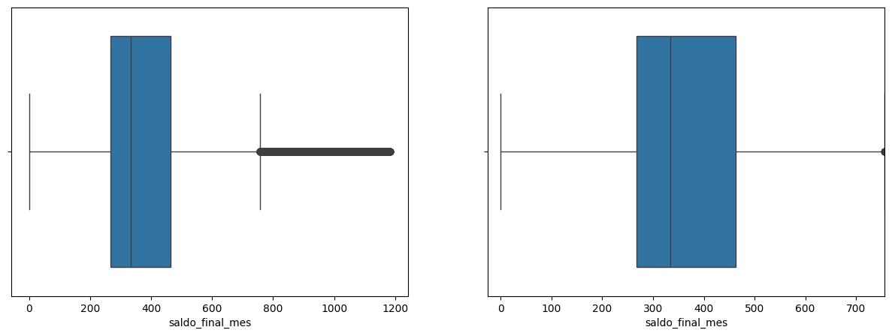

# Modelagem Preditiva de Risco de Crédito: Avaliando o Impacto do Tratamento de Outliers em Modelos de Classificação

[](https://www.python.org/downloads/)
[](https://jupyter.org/)

## Visão Geral do Projeto

Este projeto implementa um pipeline completo de machine learning para prever o score de crédito de clientes bancários. O objetivo é desenvolver modelos preditivos precisos que possam auxiliar na avaliação de risco de crédito.

Uma característica única deste projeto é a análise comparativa do impacto dos outliers na performance dos modelos. Foram desenvolvidas três abordagens paralelas:
1. Modelo com remoção de todos os outliers (jupyter notebook prev_score_cliente.ipynb)
2. Modelo mantendo todos os outliers (jupyter notebook prev_score_cliente_sem_tirar_outliers.ipynb)
3. Modelo com analise exploratória simples (jupyter notebook prev_score_cliente_anal_expl_simp.ipynb)
 
O objetivo é entender um pouco da influência dos outliers para este modelo e futuramente fazer uma análise exploratória mais robusta para comparar com os resultados aqui obtidos e finalmente, de maneira mais precisa, entender ainda melhor a influencia dos outliers na performance dos modelos de previsão.

## Instruções de Instalação

1. Clone este repositório:
```bash
git clone https://github.com/igorpedrozo27/previsao_score_credito_cliente.git
cd previsao_score_credito_cliente
```

2. Crie e ative um ambiente virtual (recomendado):
```bash
python -m venv venv
source venv/bin/activate  # Linux/Mac
venv\Scripts\activate     # Windows
```

3. Instale as dependências necessárias:
```bash
pip install pandas numpy scikit-learn matplotlib seaborn jupyter
```

## Como Executar o Projeto

O projeto está organizado em notebooks Jupyter que podem ser executados sequencialmente:

1. Para análise com remoção de todos os outliers:
```bash
jupyter notebook "prev_score_cliente.ipynb"
```

2. Para análise mantendo outliers:
```bash
jupyter notebook "prev_score_cliente_sem_tirar_outliers.ipynb"
```
3. Para modelo com análise exploratória simples:
```bash
jupyter notebook "prev_score_cliente_anal_expl_simp.ipynb"
```

##  Descrição dos Dados Utilizados

O dataset utilizado contém informações financeiras e demográficas dos clientes, incluindo:
- idade – Idade do cliente
- salario_anual – Renda anual declarada
- mix_credito – Variedade de tipos de contas de crédito que um indivíduo possui
- divida_total – Valor total das dívidas do cliente
- num_pagamentos_atrados – Número de ocorrências recentes de atraso
- idade_historico_credito - Tempo que suas contas de crédito estão abertas, ou seja, quanto tempo você mantém contas como cartões de crédito, empréstimos e financiamentos
- juros_emprestimo - Taxa cobrada sobre a linha de crédito
- dias_atraso - Tempo de inadimplência
- score_credito – Classificação do score de crédito (variável alvo), categórica (Ruim (Poor), Ok (Standard), Bom (Good)).

## Visualizações

O projeto inclui diversas visualizações para análise exploratória dos dados:
- Correlações entre features


- Análise de outliers



- Importância das features


- Performance dos modelos


## Métricas de Avaliação

Os modelos foram avaliados utilizando:
- Acurácia
- Matriz de Confusão
- Relatório de Classificação (Precision, Recall, F1-Score)

## Modelos de Machine Learning

### Algoritmos Implementados
- Random Forest Classifier
- KNN Classifier

### Resultados Comparativos

#### Modelo com Outliers:
- Random Forest Classifier: Accuracy = 83.32%
- KNN Classifier: Accuracy = 75.09%

#### Modelo sem Outliers:
- Random Forest Classifier: Accuracy = 83.63%
- KNN Classifier: Accuracy = 75.44%

#### Modelo com Análise Exploratória Simples para remoção de Outliers:
- Random Forest Classifier: Accuracy = 83.84%
- KNN Classifier: Accuracy = 75.05%

### Análise do Impacto da Remoção de Outliers no Modelo de Classificação

Este relatório consolida os resultados obtidos a partir de diferentes execuções do pipeline de machine learning. O objetivo é avaliar o impacto de diferentes configurações (como presença de outliers e variações no ajuste do modelo) sobre o desempenho de um classificador multiclasse nas categorias: `Good`, `Poor` e `Standard`.

---

## Visão Geral das Acurácias

| Classe     | Accuracy (Com Outliers) | Accuracy (Sem Outliers) | Accuracy (Exploração Simples) |
|------------|--------------------------|---------------------------|-------------------------------|
| Good       | 80,19%                   | 80,09%                    | 81,06%                        |
| Poor       | 86,05%                   | 84,41%                    | 85,50%                        |
| Standard   | 82,60%                   | 84,38%                    | 84,07%                        |


---
## Visão Geral dos Experimentos

| Experimento                   | Total de Amostras | Accuracy (Geral) | F1 (Macro) | F1 (Weighted) | Observações |
|------------------------------|-------------------|------------------|------------|----------------|-------------|
| **Com Outliers**             | 20.000            | 0.83             | 0.82       | 0.83           | Erros concentrados na classe Standard. |
| **Sem Outliers**             | 15.672            | 0.84             | 0.83       | 0.84           | Redução de 21,64% da base. Melhora na classe Standard. |
| **Análise Exploratória Simples** | 17.812        | 0.84             | 0.84       | 0.84           | Classificação mais balanceada. Poucas confusões com "Poor". |
---

## A Importância dos Outliers em Modelos de Classificação

Outliers são observações que se desviam significativamente do padrão geral dos dados. Sua presença pode ser tanto **ruidosa e prejudicial** quanto **informativa e essencial**, dependendo do contexto e da tarefa.

---

## Comparativo por Classe

### Classe `Good`

- A **Acurácia** permanece estável nos três cenários **(80,09% a 81,06%)**, sugerindo que a classe Good é robusta a mudanças de pré-processamento.
- **Precision / Recall** oscilam em torno de **0.80–0.81**.
- Principais erros: confundida com **"Standard"**.
- O leve ganho na versão com análise simples indica que a limpeza parcial dos dados pode ajudar sem comprometer representatividade. 
- Desempenho consistente, **pouco afetado pela presença de outliers**. Pode ser que o bom pagador seja alguém que se planeje bem financeiramente e por isso independe de parâmetros como salário anual altíssimo ou muito baixo.

### Classe `Poor`

- **Recall sempre alto (~0.84–0.86)** → o modelo identifica bem essa classe.
- Após remoção, houve uma queda de quase 2 p.p., o que reforça que nem todos os outliers eram “ruído”.
- A análise exploratória simples recupera parte do desempenho (85,50%), sugerindo um meio-termo ideal entre volume e ruído.
- **Confusões frequentes com "Standard"**, indicando semelhança de atributos.
- Como a abordagem de remoção de outliers foi enviesada para a exclusão de outliers que indicassem clientes altamente inadimplentes, é esperado que esta classe sofra com a remoção dos outliers desta análise. Principalmente pela quantidade relativamente limitada de amostras. Obteve melhor acurácia com outliers (86,05%), o que indica que os outliers continham informações úteis para identificar essa classe.

### Classe `Standard`

- Classe com maior suporte (até **10.729 amostras**).
- Melhor desempenho geral (**F1-score ~0.84–0.85**).
- **Maior fonte de erro absoluto**, especialmente confusões com "Poor" e "Good".
- Mostra o maior ganho ao remover outliers, passando de 82,60% → 84,38%.
- Isso sugere que os outliers estavam afetando negativamente essa classe, possivelmente por distorcer padrões frequentes.
- Como é a classe mais representada, a melhoria teve impacto relevante no desempenho geral.
- A versão com análise simples mantém a performance alta (84,07%), o que valida a abordagem híbrida.

---

## Análise das Matrizes de Confusão

- A classe `Standard` atua como **zona cinzenta**: é a mais confundida e a que mais recebe predições incorretas.
- A retirada de outliers **reduziu confusões** com a classe `Standard`, melhorando seu desempenho.
- As confusões entre `Good` e `Poor` são **mínimas**, o que mostra que o modelo consegue diferenciar bem essas classes.

---

## Recomendações Finais para Aprimoramento da Análise

1. **Aprofundar a análise entre "Standard" e as demais classes**.
2. Adotar técnicas de detecção de outliers mais robustas e seletivas, como:
    - Isolation Forest
    - DBSCAN
    - Z-score por classe

3. Aplicar visualizações dimensionais (PCA, t-SNE, UMAP) para inspecionar separabilidade.
4. Testar estratégias de reamostragem para balancear as classes (`SMOTE`, `undersampling`, etc.).
5. Realizar tuning de thresholds de decisão para suavizar confusões entre classes próximas.
6. Avaliar modelos baseados em boosting (`XGBoost`, `LightGBM`) para capturar relações não-lineares.
7. Desenvolver uma API para servir o modelo.

---

## Conclusões sobre o Modelo

- O modelo tem desempenho **sólido e balanceado**, mesmo em cenários com dados desbalanceados.
- A remoção de outliers gerou um **ganho marginal na acurácia e F1**, especialmente para a classe `Standard`.
- Mas também **eliminou variações legítimas importantes** em outras classes (especialmente `Poor`), o que mostra que o tratamento de outliers **precisa ser feito de forma cuidadosa e contextualizada**.
- Há **boa capacidade de generalização**, com variações pequenas entre execuções.

## Conclusões sobre a Importância dos Outliers

### 1. **Outliers não são sempre “ruídos” – eles podem conter informação valiosa**
- No caso da **classe `Poor`**, a **remoção de outliers prejudicou o desempenho do modelo**, com queda de quase 2 pontos percentuais no recall.
- Isso indica que **os outliers estavam ajudando na identificação de clientes inadimplentes**, possivelmente por refletirem comportamentos extremos mas recorrentes em inadimplencia (ex: dívidas muito altas, renda muito baixa, etc).
- Eliminar outliers indiscriminadamente **pode levar à perda de informações críticas**, especialmente em classes minoritárias e com características mais extremas.

---

### 2. **Impacto dos outliers varia conforme a classe**
- A **classe `Good`** mostrou **alta estabilidade**, independentemente da presença de outliers. Isso sugere que **os bons pagadores têm padrões mais consistentes**, e o modelo consegue reconhecê-los mesmo com dados ruidosos.
- Em contrapartida, a **classe `Standard`** teve o **maior ganho de desempenho com a remoção de outliers**.
  - Isso indica que os outliers estavam **atrapalhando o aprendizado de padrões dessa classe**, que é a mais representada. Ou seja, os outliers estavam provavelmente **distorcendo padrões mais "normais"**.

---

### 3. **A estratégia de pré-processamento ideal depende da classe-alvo e do objetivo**
- Se o foco do modelo for, por exemplo, **identificar inadimplentes (`Poor`)**, convém **preservar alguns outliers**, pois eles ajudam a capturar casos extremos de risco.
- Já se o foco for melhorar a performance geral ou identificar **casos típicos (`Standard`)**, a **remoção seletiva de outliers pode ser benéfica**.

---

### 4. **Análise exploratória simples pode recuperar parte do desempenho perdido**
- A versão com **análise exploratória simples (sem remoção total de outliers)** apresentou um **equilíbrio entre redução de ruído e manutenção da representatividade**.
- Isso reforça que **estratégias híbridas** – como tratar apenas outliers extremos, ou aplicar transformações em vez de remover – **podem ser mais eficazes do que abordagens radicais**.

---

## Conclusão Final

A presença ou remoção de outliers **impacta de maneira diferente cada classe do modelo**, e tratá-los de forma indiscriminada pode comprometer a performance. **É essencial que o tratamento de outliers**:

- **Considere o contexto do negócio** (ex: inadimplência pode vir com comportamentos extremos).
- **Seja orientado por análise exploratória e validação empírica**.
- **Equilibre o ganho de generalização com a preservação de casos informativos**, especialmente em conjuntos de dados desbalanceados.

> Portanto, **os outliers devem ser avaliados estrategicamente dentro do pipeline de modelagem preditiva**.

---

##  Recomendações sobre o Tratamento de Outliers

Com base na análise do impacto dos outliers por classe, recomenda-se:

### 1. **Evitar a remoção indiscriminada de outliers**
- Nem todos os outliers são “ruídos”. Muitos carregam informações importantes para a modelagem, especialmente para **classes minoritárias ou com padrões extremos**, como `Poor`.
- Avalie a distribuição de variáveis por classe antes de aplicar filtros agressivos.

### 2. **Ajustar o tratamento de outliers conforme a classe e o objetivo do modelo**
- Para modelos cujo objetivo é identificar **inadimplência**, mantenha parte dos outliers — eles ajudam a capturar casos críticos.
- Para melhorar o desempenho geral ou focar em **comportamentos mais comuns (`Standard`)**, uma **remoção seletiva ou transformação** pode trazer ganhos significativos.

### 3. **Adotar abordagens híbridas no pré-processamento**
- Ao invés de remover totalmente os outliers, utilize:
  - Winsorization (limitação de valores extremos)
  - Transformações log ou Box-Cox
  - Detecção por IQR ou Z-score, mas aplicada de forma segmentada
- A análise exploratória simples se mostrou eficaz em recuperar performance, **preservando volume e reduzindo ruído**.

### 4. **Monitorar o impacto por métrica e por classe**
- Avalie continuamente como o tratamento de outliers afeta:
  - Recall para classes críticas (ex: `Poor`)
  - F1-score para a classe majoritária (`Standard`)
  - Precision para classes com maior custo de erro

---

> Em resumo: **o tratamento de outliers deve ser uma decisão guiada por dados, contexto de negócio e testes empíricos.**

---

*Este relatório serve como base para futuras iterações no modelo, guiando a escolha de estratégias de pré-processamento e modelagem mais eficazes.*

---

## Contribuições
Contribuições são sempre bem-vindas! Por favor, sinta-se à vontade para abrir um Issue ou enviar um Pull Request.

---
