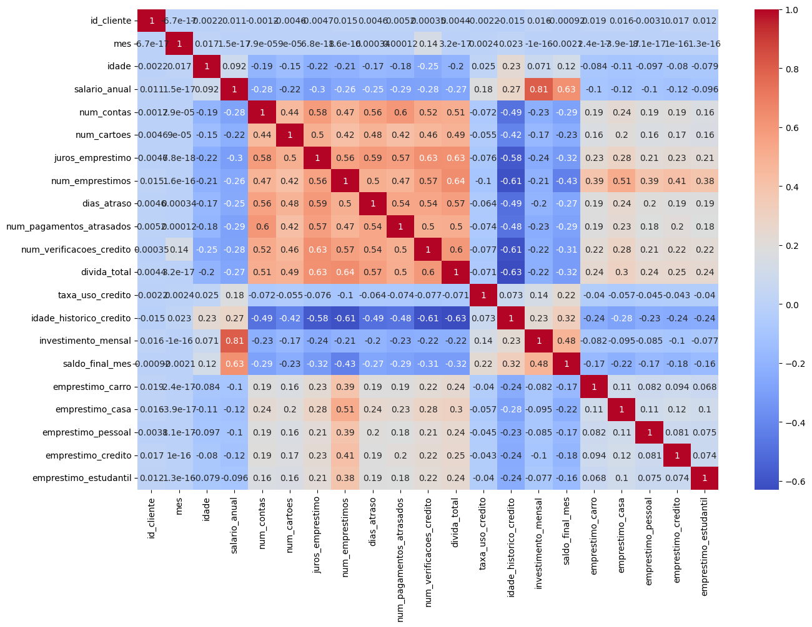
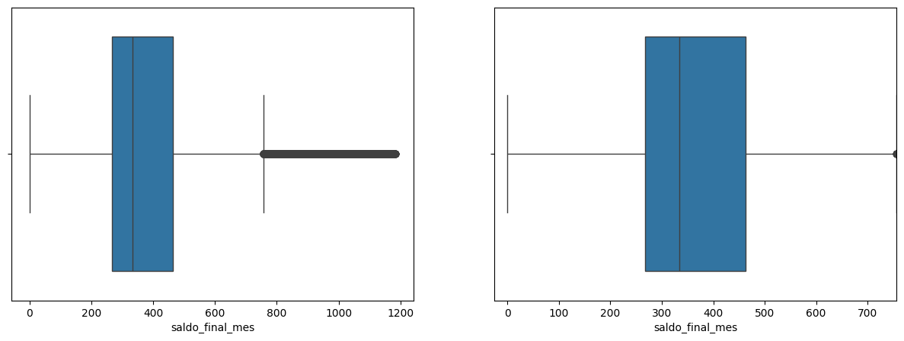
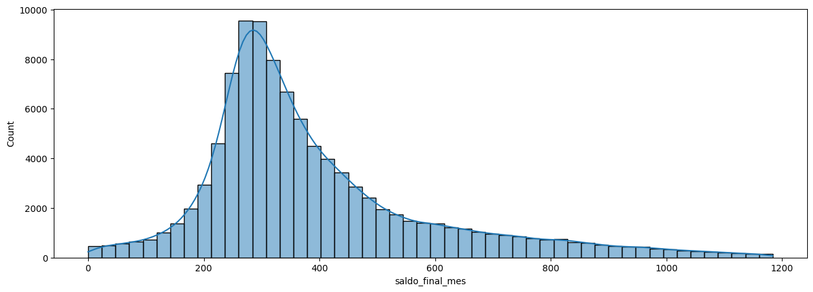
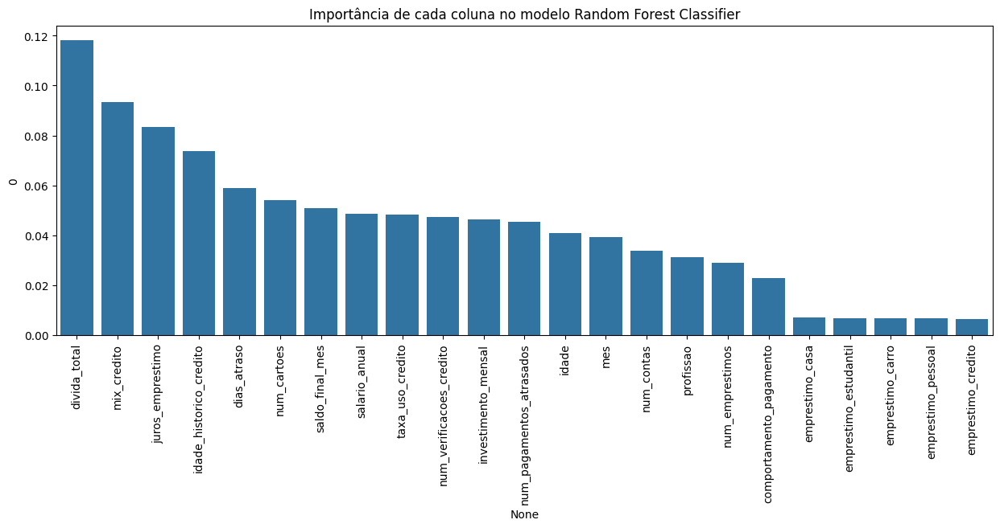
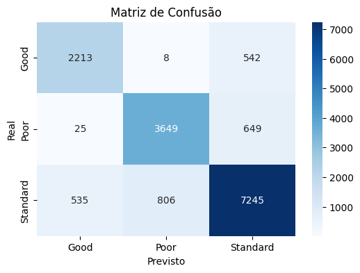

# Credit Risk Predictive Modeling: Evaluating the Impact of Outlier Treatment on Classification Models

[](https://www.python.org/downloads/)
[](https://jupyter.org/)

## Project Overview

This project implements a complete machine learning pipeline to predict the credit score of banking customers. The goal is to develop accurate predictive models that assist in credit risk evaluation.

A unique feature of this project is the comparative analysis of the impact of outliers on model performance. Three parallel modeling approaches were developed:

1. Model with all outliers removed (`client_score_prediction.ipynb`)  
2. Model with all outliers retained (`client_score_prediction_outliers_retained.ipynb`)  
3. Model using a simplified exploratory analysis (`client_score_prediction_simp_expl_anal.ipynb`)  

The goal is to better understand the influence of outliers and guide future decisions on data preprocessing strategies to improve classification models.

### Clone this repository:

```bash
git clone https://github.com/igorpedrozo27/estudo_trat_outliers_modelo_classif.git
cd estudo_trat_outliers_modelo_classif
```

## Project Structure

The Jupyter Notebooks contain all modeling steps and are organized as follows:

```bash
# With all outliers removed
jupyter notebook "client_score_prediction.ipynb"

# With all outliers retained
jupyter notebook "client_score_prediction_outliers_retained.ipynb"

# With simplified exploratory analysis
jupyter notebook "client_score_prediction_simp_expl_anal.ipynb"
```

## Dataset Description

The dataset includes financial and demographic attributes of customers, such as:

- `idade`: Age  
- `salario_anual`: Annual declared income  
- `mix_credito`: Types of credit accounts  
- `divida_total`: Total debt  
- `num_pagamentos_atrados`: Number of late payments  
- `idade_historico_credito`: Length of credit history  
- `juros_emprestimo`: Interest rate  
- `dias_atraso`: Days past due  
- `score_credito`: Target variable (categories: Poor, Standard, Good)

## Visualizations

The notebooks include:

- Correlation matrix  


- Outlier distribution analysis  



- Feature importance  


- Model performance comparison



## Evaluation Metrics

- Accuracy  
- Confusion Matrix  
- Classification Report (Precision, Recall, F1-score)

## ML Algorithms Used

- Random Forest Classifier  
- K-Nearest Neighbors (KNN)

## Comparative Results

### With Outliers  
- Random Forest: 83.32%  
- KNN: 75.09%

### Without Outliers  
- Random Forest: 83.63%  
- KNN: 75.44%

### Simple Exploratory Filtering  
- Random Forest: 83.84%  
- KNN: 75.05%

### Analysis of the Impact of Outlier Removal on the Classification Model

This report consolidates the results obtained from different executions of the machine learning pipeline. The goal is to evaluate the impact of different configurations (such as the presence of outliers and variations in model tuning) on the performance of a multiclass classifier for the categories: `Good`, `Poor`, and `Standard`.

---

## Accuracy Overview

| Class     | Accuracy (With Outliers) | Accuracy (Without Outliers) | Accuracy (Simple Exploration) |
|----------|---------------------------|------------------------------|-------------------------------|
| Good     | 80.19%                    | 80.09%                       | 81.06%                        |
| Poor     | 86.05%                    | 84.41%                       | 85.50%                        |
| Standard | 82.60%                    | 84.38%                       | 84.07%                        |


---

## Experiment Summary

| Experiment                     | Total Samples | Accuracy (Overall) | F1 (Macro) | F1 (Weighted) | Notes |
|--------------------------------|----------------|---------------------|------------|----------------|-------|
| **With Outliers**              | 20,000         | 0.83                | 0.82       | 0.83           | Errors concentrated in the Standard class. |
| **Without Outliers**           | 15,672         | 0.84                | 0.83       | 0.84           | 21.64% reduction in dataset. Improvement in Standard class. |
| **Simple Exploratory Analysis**| 17,812         | 0.84                | 0.84       | 0.84           | More balanced classification. Few confusions with "Poor". |

---

## The Importance of Outliers in Classification Models

Outliers are observations that deviate significantly from the general data pattern. Their presence can be either **noisy and harmful** or **informative and essential**, depending on the context and the task.

---

## Class Comparison

### Class `Good`

- **Accuracy** remains stable across all scenarios **(80.09% to 81.06%)**, suggesting robustness to preprocessing changes.
- **Precision / Recall** fluctuate around **0.80–0.81**.
- Most common error: confused with **"Standard"**.
- The slight gain in the simple analysis version suggests that partial cleaning can help without compromising representativeness.
- Consistent performance, **barely affected by the presence of outliers**. Possibly because good payers tend to be financially organized regardless of extreme parameters like very high or very low annual income.

### Class `Poor`

- **Recall is consistently high (~0.84–0.86)** → the model reliably identifies this class.
- Removing outliers caused a drop of nearly 2 percentage points, indicating that not all outliers were noise.
- The simple exploratory analysis recovers part of the performance (85.50%), suggesting an ideal middle ground between volume and noise.
- **Frequent confusion with "Standard"**, showing similar attributes.
- Since the outlier removal approach was biased toward excluding highly delinquent clients, it's expected that this class would suffer from that. The class performed best with outliers (86.05%), indicating they held useful information for identification.

### Class `Standard`

- Largest class with up to **10,729 samples**.
- Best overall performance (**F1-score ~0.84–0.85**).
- **Largest source of absolute error**, especially confusion with "Poor" and "Good".
- Shows the most improvement after removing outliers (from 82.60% → 84.38%).
- Suggests that outliers were negatively affecting this class by distorting common patterns.
- As the most represented class, the improvement had significant impact on overall performance.
- The simple analysis version maintains strong performance (84.07%), validating the hybrid approach.

---

## Confusion Matrix Analysis

- The `Standard` class acts as a **gray zone**: it’s the most confused and misclassified class.
- Removing outliers **reduced confusion** with `Standard`, improving its performance.
- Confusions between `Good` and `Poor` are **minimal**, showing the model distinguishes these classes well.

---

## Final Recommendations for Improving the Analysis

1. **Deepen the analysis between "Standard" and other classes**.
2. Adopt more robust and selective outlier detection techniques, such as:
    - Isolation Forest
    - DBSCAN
    - Class-specific Z-score

3. Use dimensionality reduction visualizations (PCA, t-SNE, UMAP) to inspect class separability.
4. Test resampling strategies to balance classes (`SMOTE`, `undersampling`, etc.).
5. Tune decision thresholds to reduce confusion between neighboring classes.
6. Evaluate boosting-based models (`XGBoost`, `LightGBM`) to capture nonlinear patterns.
7. Develop an API to serve the model.

---

## Conclusions on the Model

- The model shows **solid and balanced performance**, even with imbalanced data.
- Outlier removal yielded a **marginal gain in accuracy and F1**, especially for the `Standard` class.
- However, it also **eliminated important legitimate variations** in other classes (especially `Poor`), highlighting the need for **careful and contextualized outlier treatment**.
- It demonstrates **good generalization capability**, with minimal variation across runs.

## Conclusions on the Importance of Outliers

### 1. **Outliers are not always "noise" – they can hold valuable information**
- For the **`Poor` class**, removing outliers **harmed the model's performance**, with nearly a 2-point drop in recall.
- This indicates that **outliers were aiding in identifying delinquent clients**, possibly reflecting extreme but recurring behavior patterns (e.g., very high debt, very low income).
- Indiscriminate outlier removal can **lead to the loss of critical information**, especially in minority classes with extreme characteristics.

---

### 2. **Outlier impact varies by class**
- The **`Good` class** showed **high stability** regardless of outlier presence. This suggests that **good payers have more consistent patterns**, and the model recognizes them even in noisy data.
- On the other hand, the **`Standard` class** saw the **greatest performance improvement from outlier removal**.
  - This indicates outliers were **hindering the learning of typical patterns** in this class, likely by **distorting more "normal" behavior**.

---

### 3. **The ideal preprocessing strategy depends on target class and business goal**
- If the goal is to **identify delinquent clients (`Poor`)**, it makes sense to **retain some outliers**, as they help capture high-risk cases.
- If the goal is to improve overall performance or identify **typical behavior (`Standard`)**, **selective outlier removal or transformation** can yield significant gains.

---

### 4. **Simple exploratory analysis can recover lost performance**
- The version with **simple exploratory analysis (no full outlier removal)** struck a **balance between reducing noise and preserving representativeness**.
- This reinforces that **hybrid strategies** – such as treating only extreme outliers or applying transformations – **can be more effective than radical approaches**.

---

## Final Conclusion

The presence or removal of outliers **impacts each model class differently**, and indiscriminate handling can compromise performance. **Effective outlier treatment must**:

- **Account for business context** (e.g., delinquency often involves extreme behavior).
- **Be guided by exploratory analysis and empirical validation**.
- **Balance generalization gains with the preservation of informative cases**, especially in imbalanced datasets.

> In short, **outliers must be assessed strategically within the predictive modeling pipeline**.

---

## Recommendations on Outlier Treatment

Based on the class-specific impact analysis:

### 1. **Avoid indiscriminate outlier removal**
- Not all outliers are noise. Many carry important information for modeling, especially for **minority or extreme-pattern classes** like `Poor`.
- Always evaluate variable distributions by class before applying aggressive filtering.

### 2. **Adjust outlier treatment based on class and modeling objective**
- For models aimed at **identifying delinquency**, retain some outliers — they help capture critical cases.
- For improving overall performance or focusing on **typical behaviors (`Standard`)**, **selective removal or transformation** may bring meaningful improvements.

### 3. **Use hybrid preprocessing approaches**
- Instead of fully removing outliers, consider:
  - Winsorization (limiting extreme values)
  - Log or Box-Cox transformations
  - IQR or Z-score detection applied per class
- The simple exploratory analysis proved effective in recovering performance, **preserving data volume while reducing noise**.

### 4. **Monitor impact by metric and by class**
- Continuously evaluate how outlier treatment affects:
  - Recall for critical classes (e.g., `Poor`)
  - F1-score for major class (`Standard`)
  - Precision for classes with high error costs

---

> In summary: **outlier treatment should be a data-driven decision guided by business context and empirical testing.**

---

*This report serves as a foundation for future iterations of the model, guiding the selection of more effective preprocessing and modeling strategies.*

---

## Contributions
Contributions are always welcome! Feel free to open an Issue or submit a Pull Request.

---